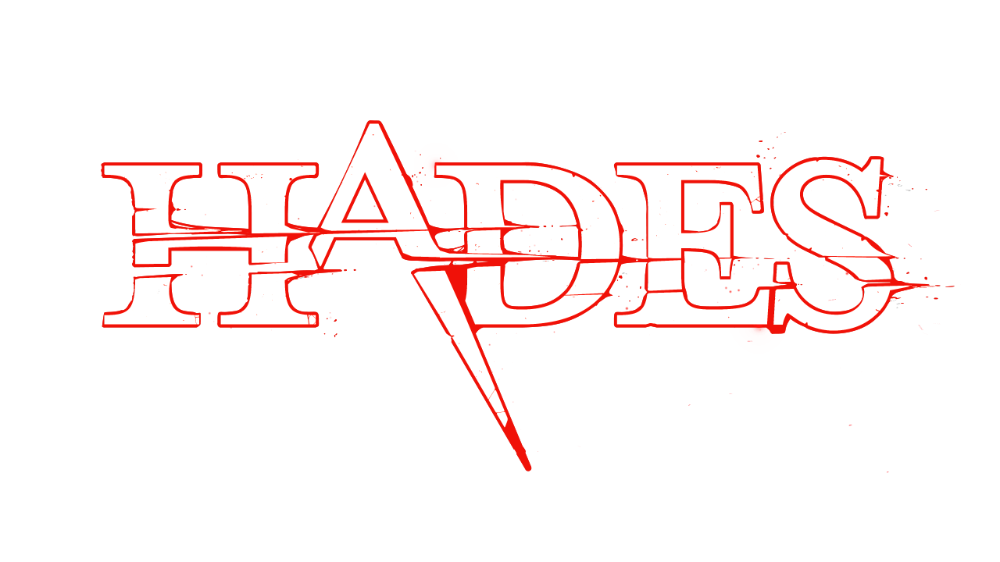
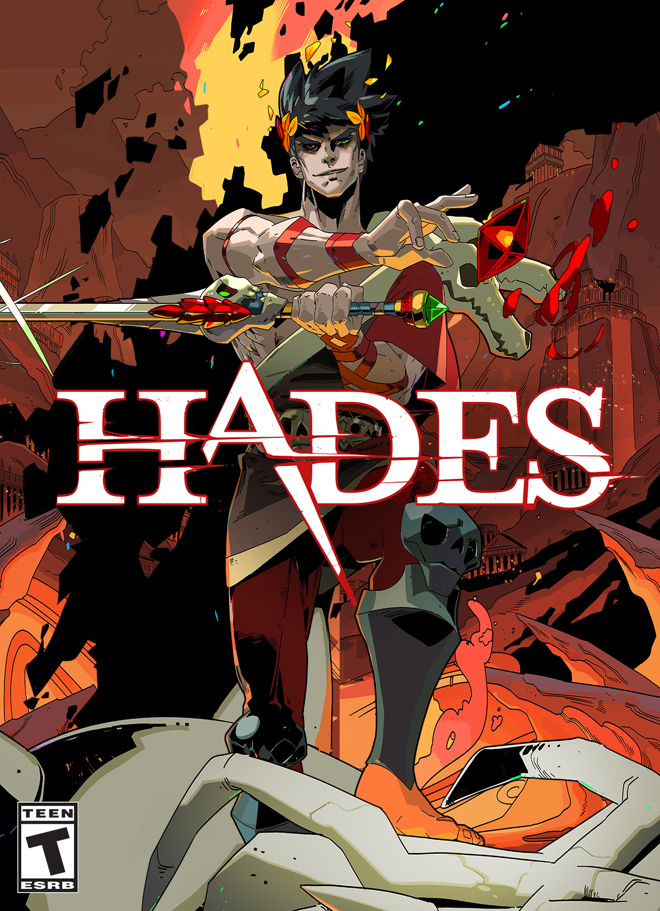
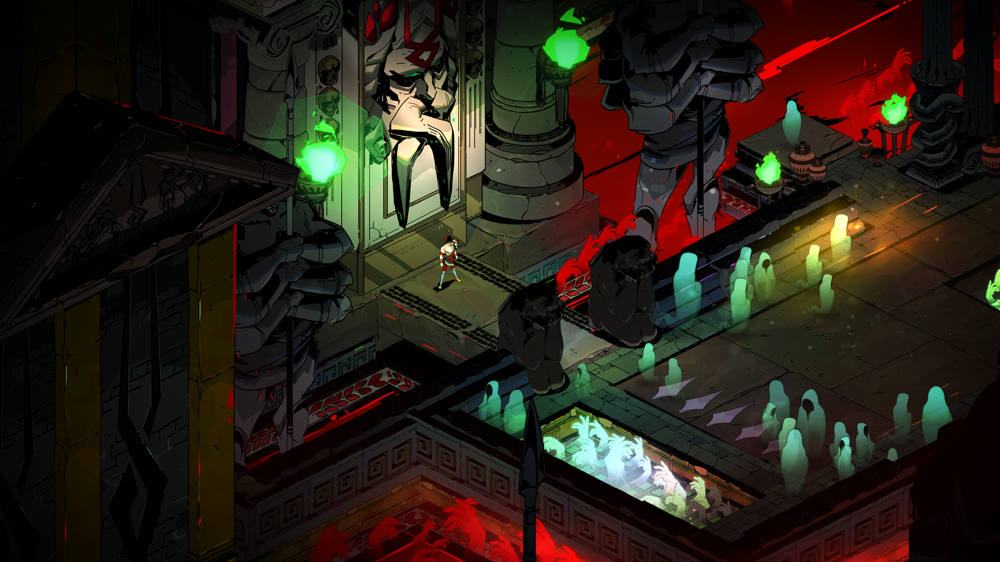
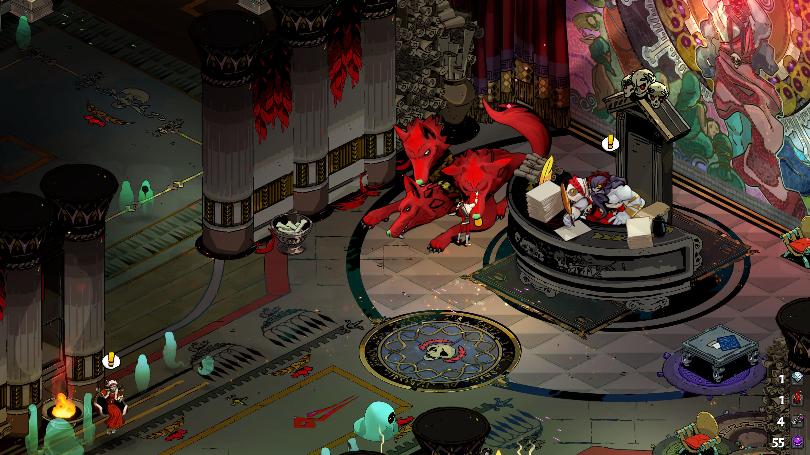
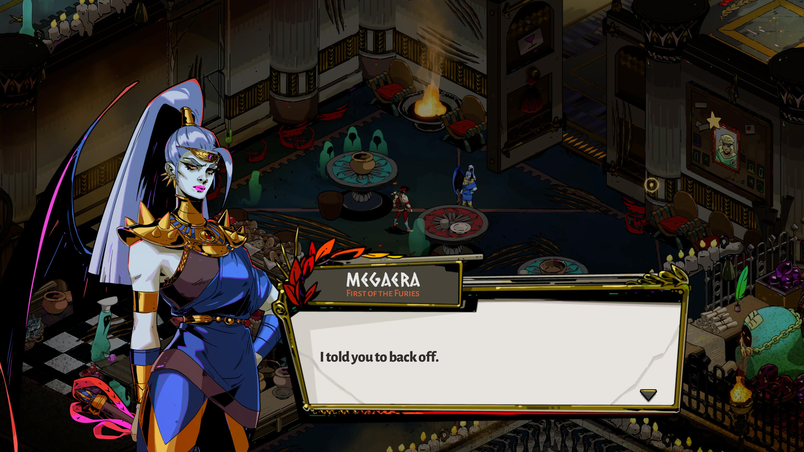
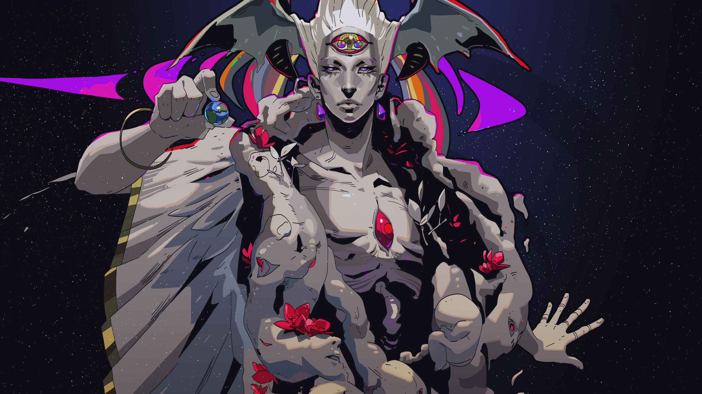
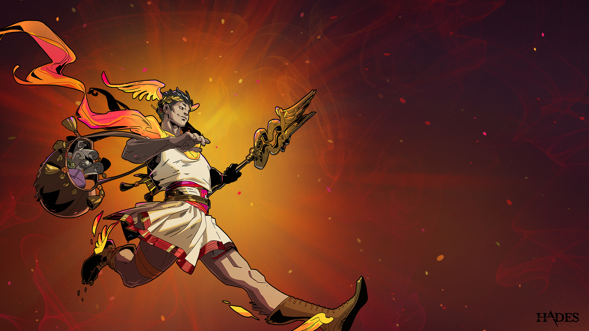
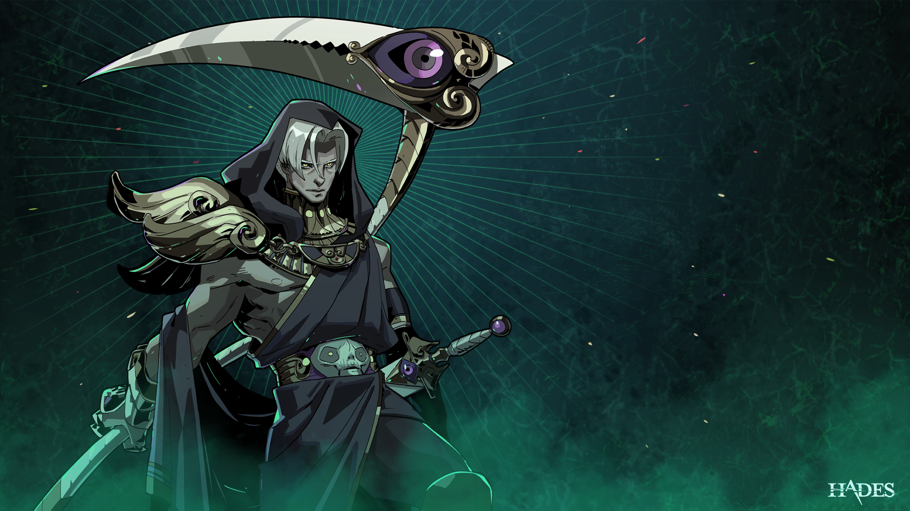
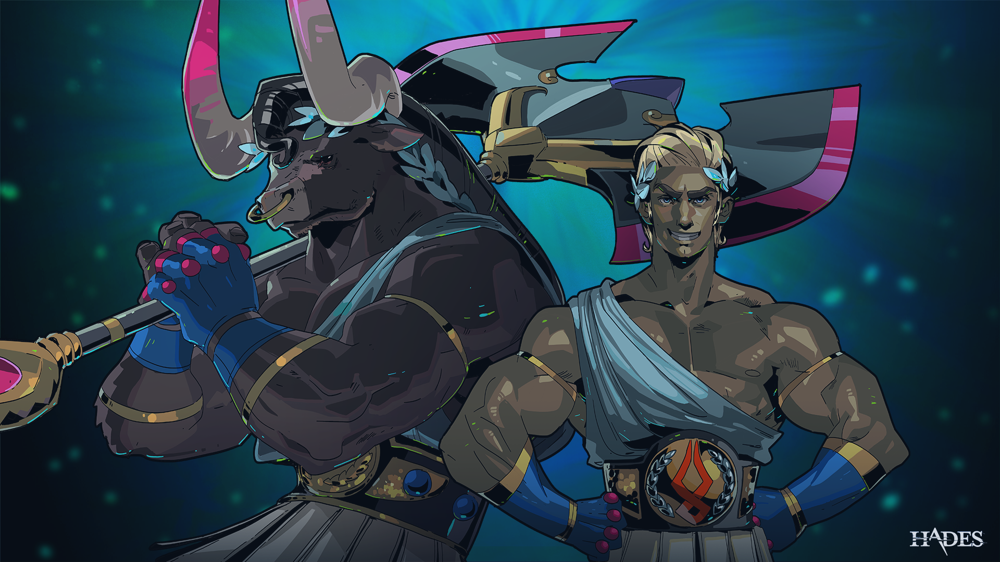
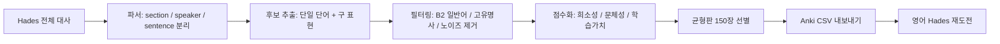

# <div align="center">Hades Deck</div>

<div align="center">
  
</div>

<div align="center">
  
</div>

<div align="center">
  
</div>

<div align="center">
  <a href="https://github.com/mym0404/hades-deck"></a>
  <a href="./cards/hades-anki.csv"></a>
  
  
  
  
</div>

<div align="center">
  
  
  
  
</div>

<br />

<div align="center">
  <table>
    <tr>
      <td align="center"><a href="./cards/hades-anki.csv"><strong>Deck 바로 받기</strong></a></td>
      <td align="center"><a href="https://raw.githubusercontent.com/mym0404/hades-deck/main/cards/hades-anki.csv"><strong>Raw CSV 다운로드</strong></a></td>
      <td align="center"><a href="#어떻게-쓰는가"><strong>바로 쓰는 법</strong></a></td>
      <td align="center"><a href="#파이프라인"><strong>선별 방식 보기</strong></a></td>
    </tr>
  </table>
</div>

---

> Hades를 영어로 켰다.  
> 그리고 곧 깨달았다.  
> 내가 로그라이크를 하는 건지, 고전풍 어휘에게 두들겨 맞는 건지 구분이 안 간다.
>
> 그래서 이 저장소를 만들었다.  
> 모르는 단어를 그냥 참는 대신, 대사 전체를 긁어와서,  
> 너무 쉬운 단어는 덜어내고, 신화풍이고 문학적이고 게임 이해에 중요한 것만 골라  
> Anki 카드 CSV로 정리해 버리는 프로젝트다.

솔직히 말하면 이 프로젝트의 철학은 꽤 단순하다.  
날 일단 믿어라. 그럼 너는 단어를 쌀 것이다.  
그리고 단어를 쏟아내기 시작하면, 전에는 그냥 멋있기만 하던 대사가 이제는 의미까지 들리기 시작한다.

<div align="center">
  <table>
    <tr>
      <td align="center" width="25%"><strong>증상 1</strong></td>
      <td align="center" width="25%"><strong>증상 2</strong></td>
      <td align="center" width="25%"><strong>증상 3</strong></td>
      <td align="center" width="25%"><strong>증상 4</strong></td>
    </tr>
    <tr>
      <td align="center">대사는 멋있는데 뜻은 안 들어온다.</td>
      <td align="center">대충 화난 건 알겠는데 왜 화난지 모른다.</td>
      <td align="center">스토리 이해를 분위기로 때운다.</td>
      <td align="center">나중에 복습하겠다고 해놓고 아무것도 안 한다.</td>
    </tr>
  </table>
</div>

<div align="center">
  
</div>

---

## 이 저장소가 하는 일

<div align="center">
  
</div>

좋게 말하면 어휘 학습용 파이프라인이고, 더 정확히 말하면 영어 Hades에게 당한 사람이 만든 보복 장치다.

<table>
  <tr>
    <td width="33%" align="center">
      <strong>대사 전체 분석</strong>
      <br />
      Hades 전체 대사를 긁어와서 section, speaker, sentence 단위로 구조화한다.
    </td>
    <td width="33%" align="center">
      <strong>쓸모없는 카드 제거</strong>
      <br />
      B2 이하 일반어, 고유명사, 잡음 토큰, 낭비 카드 후보를 최대한 걷어낸다.
    </td>
    <td width="33%" align="center">
      <strong>균형판 150장 제공</strong>
      <br />
      고전풍, 신화풍, 드라마틱한 어휘를 중심으로 바로 넣을 수 있는 CSV를 제공한다.
    </td>
  </tr>
</table>

<div align="center">
  
</div>

## 무엇이 들어 있나

| 항목 | 설명 |
| --- | --- |
| `cards/hades-anki.csv` | 최종 균형판 Anki Deck CSV |
| `src/data/curated-cards.ts` | 코어 카드 + 확장 카드 합본 export |
| `src/data/balanced-cards.ts` | 150장 균형판을 만드는 추가 카드 데이터 |
| `src/core/analyzer.ts` | 대사 후보 추출, 필터링, 점수화 |
| `src/cli/main.ts` | `rank`, `sample`, `export-anki`, `validate-anki` CLI |

이 파일들을 점잖게 설명하면 “학습 자산”이지만, 좀 더 정직하게 말하면  
스토리를 가로막던 단어들을 한 장씩 끌어내려 앉히는 장비 세트다.  
서사가 귓구멍으로 바로 꽂힌다고까지는 못 해도, 적어도 왜 안 들리는지는 빠르게 들통난다.

---

## 갤러리

<div align="center">
  <table>
    <tr>
      <td align="center" width="50%">
        
      </td>
      <td align="center" width="50%">
        
      </td>
    </tr>
    <tr>
      <td align="center" width="50%">
        
      </td>
      <td align="center" width="50%">
        
      </td>
    </tr>
  </table>
</div>

<details>
  <summary><strong>벽지처럼 더 깔아두기</strong></summary>
  <br />
  <div align="center">
    
    
    
  </div>
  <br />
  <div align="center">
    
  </div>
</details>

---

## 왜 굳이 Anki냐

<div align="center">
  <table>
    <tr>
      <td align="center"><strong>기존 방식</strong></td>
      <td align="center"><strong>이 README가 주장하는 방식</strong></td>
    </tr>
    <tr>
      <td align="center">모르면 넘긴다</td>
      <td align="center">모르면 덱으로 만들어서 끝까지 쫓아간다</td>
    </tr>
    <tr>
      <td align="center">분위기로 이해한 척한다</td>
      <td align="center">복습으로 분위기와 뜻을 같이 먹는다</td>
    </tr>
    <tr>
      <td align="center">나중에 외우겠다고 말만 한다</td>
      <td align="center">CSV를 집어넣고 바로 맞는다</td>
    </tr>
  </table>
</div>

<table>
  <tr>
    <td width="50%">
      Hades 대사는 분위기가 좋다. 문제는 분위기만 좋은 게 아니라 단어도 아주 세게 들어온다는 점이다.
      <br />
      <br />
      `wrath`, `denizen`, `transpire`, `chthonic`, `deference` 같은 단어를 그냥 넘기면 스토리의 뉘앙스가 통째로 흐려진다.
    </td>
    <td width="50%">
      그래서 이 프로젝트는 “단어장을 만드는 도구”가 아니라, “영어 Hades를 제대로 즐기기 위한 구조적 복수”에 가깝다.
      <br />
      <br />
      한 번 맞고 끝내지 않고, CSV로 뽑아 외우고, 다시 들어가서 대사를 이해한다.
    </td>
  </tr>
</table>

스토리가 안 들리는 건 재능의 문제가 아니다.  
복습 횟수가 아직 오만하지 않아서 그렇다.  
오늘 `denizen` 하나를 외우면 내일 대사가 한 줄 더 들리고, 한 줄이 더 들리면 그 다음부터는 분위기로 아는 척하기가 조금 어려워진다.

<div align="center">
  
</div>

---

## 파이프라인



<details open>
  <summary><strong>선별 기준 요약</strong></summary>
  <br />

  | 기준 | 설명 |
  | --- | --- |
  | 희소성 | CEFR 바깥 + 일반 빈도 낮은 단어 우선 |
  | 문체성 | 신화풍, 고전풍, 문학적 톤에 가산점 |
  | 학습가치 | 예문이 선명하고 카드로 만들었을 때 기억에 남는 단어 우선 |
  | 실전성 | 실제 캐릭터 대사에서 힘을 발휘하는 단어에 가산점 |
  | 절제 | 이름, 지명, 쉬운 일반어, 어정쩡한 카드 후보는 최대한 제거 |
</details>

---

## 어떻게 쓰는가

비법처럼 보일 수 있지만 실제 과정은 단순하다.  
CSV를 넣고, 맞고, 다시 본다.  
하데스는 너를 막지 않는다. 네 단어장이 빈약한 상태로 들어오는 걸 비웃을 뿐이다.

1. [균형판 CSV](./cards/hades-anki.csv) 또는 [raw 다운로드 링크](https://raw.githubusercontent.com/mym0404/hades-deck/main/cards/hades-anki.csv)로 파일을 받는다.
2. Anki에서 `파일 가져오기`로 `cards/hades-anki.csv`를 넣는다.
3. Hades를 영어로 켠다.
4. 다시 단어에게 맞는다.
5. 하지만 이번엔 속수무책이 아니다.
6. 복습이 쌓이면 어느 순간 README가 했던 헛소리가 조금은 사실처럼 느껴진다.

---

## CLI

<details>
  <summary><strong>직접 다시 뽑고 싶다면</strong></summary>

```bash
pnpm install
pnpm cli rank --output out/ranked-candidates.csv
pnpm cli sample --text "Hades: I expect for you to show deference to her, at all times!"
pnpm cli export-anki --output cards/hades-anki.csv
pnpm cli validate-anki --input cards/hades-anki.csv
```

</details>

---

## 프로젝트 성격

이 저장소는 학술 프로젝트도 아니고, 순한 단어장도 아니다.

이건 대충 이런 흐름이다.

<table>
  <tr>
    <td align="center" width="33%"><strong>1. 맞는다</strong></td>
    <td align="center" width="33%"><strong>2. 뽑는다</strong></td>
    <td align="center" width="33%"><strong>3. 외운다</strong></td>
  </tr>
  <tr>
    <td align="center">영어 Hades가 생각보다 훨씬 난폭하다.</td>
    <td align="center">대사를 분석해서 진짜 필요한 카드만 남긴다.</td>
    <td align="center">이제 스토리를 이해하면서 다시 플레이한다.</td>
  </tr>
</table>

처음엔 반신반의해도 괜찮다.  
`chthonic`을 외운 뒤에도 여전히 모르는 단어는 남아 있을 것이다.  
다만 그때부터는 도망치는 대신 목록을 늘리게 된다. 이 README가 떠드는 톤은 과하지만, 그 방향성만큼은 의외로 멀쩡하다.

---

## 출처

- 카드 대상 대사는 Hades 대사 텍스트를 기반으로 분석했다.
- 원본 대사 소스 `@All.txt`: [https://raw.githubusercontent.com/Denperidge/Hades-Dialogues/refs/heads/main/docs/en/%40All.txt](https://raw.githubusercontent.com/Denperidge/Hades-Dialogues/refs/heads/main/docs/en/%40All.txt)
- README 시각 자산은 [Supergiant Games의 Hades 공식 페이지](https://www.supergiantgames.com/games/hades/)에서 제공되는 공식 미디어 자산을 사용했다.
- 이 저장소의 최종 목표는 Hades를 영어로 즐기되, 모르는 단어 때문에 스토리가 증발하지 않게 만드는 것이다.

<div align="center">
  
</div>
